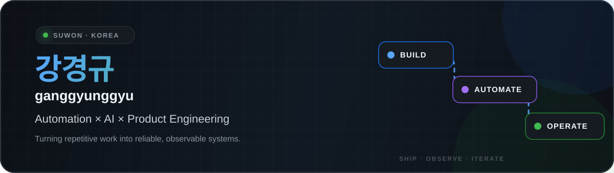

<div align="center">
  
</div>

<div align="center">
  <a href="https://velog.io/@qwzx16"></a>
  <a href="https://github.com/ganggyunggyu?tab=followers"></a>
  
</div>

## Hello, I'm Gyunggyu 👋

반복되는 일을 **관측 가능하고 신뢰할 수 있는 자동화 시스템**으로 바꾸는 개발자입니다.<br />
AI 에이전트, 브라우저 자동화, 검색 데이터 파이프라인을 실제 운영 환경까지 연결하는 일을 좋아합니다.

```text
Discover the bottleneck  →  Build the smallest useful system  →  Operate, measure, improve
```

### What I'm building

- **AI orchestration** — 여러 LLM을 하나의 제품 흐름으로 묶고 안정적인 폴백과 후처리 설계
- **Browser automation** — Playwright 기반 다중 계정·큐·세션 자동화와 운영 도구 개발
- **Search intelligence** — 검색 결과 수집, 노출 판정, Google Sheets·MongoDB 동기화
- **Product engineering** — Next.js 대시보드부터 FastAPI 백엔드, 배포와 모니터링까지 연결

## Selected work

| Project | What it does | Built with |
| :-- | :-- | :-- |
| [**cafe-bot**](https://github.com/ganggyunggyu/cafe-bot) | 다중 계정, 작업 큐, 브라우저 세션을 관리하는 네이버 카페 자동화 플랫폼 | Next.js · Playwright · BullMQ |
| [**blog-cron-bot**](https://github.com/ganggyunggyu/blog-cron-bot) | 검색 결과 노출을 수집·판정하고 시트와 DB에 동기화하는 운영 파이프라인 | TypeScript · Cheerio · MongoDB |
| [**blog_analyzer**](https://github.com/ganggyunggyu/blog_analyzer) | 8개 AI 엔진과 카테고리별 프롬프트를 통합한 콘텐츠 생성 백엔드 | FastAPI · Python · Multi-LLM |
| [**gng**](https://github.com/ganggyunggyu/gng) | 모델과 시스템 프롬프트를 프로젝트 단위로 비교하는 AI Chat Workbench | Next.js · React · IndexedDB |

## Toolbox

<div align="center">
  
</div>

<br />

<div align="center">
  
  
  
</div>

---

<div align="center">
  <sub>Build small. Run it for real. Improve what the data reveals.</sub>
</div>
